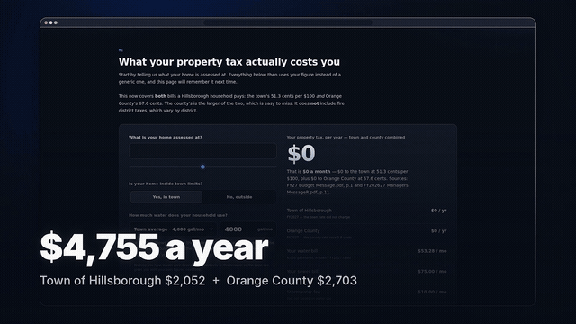

# MFAS — Municipal Financial Analysis System

**Hillsborough & Orange County fiscal transparency.**

<!-- Why these links are ABSOLUTE Pages URLs and not repo-relative paths:
       - GitHub's blob viewer REFUSES this file ("we can't show files that are this big right now"),
         so docs/media/mfas-commercial.mp4 is a dead end for a viewer.
       - raw.githubusercontent.com serves it as application/octet-stream, which downloads instead
         of playing.
       - GitHub Pages serves it as video/mp4 with Accept-Ranges, so it plays and scrubs in any
         browser. Measured, not assumed.
     ⚠️ If this repository is ever transferred to another account, these two URLs must be updated —
     they are the only absolute links in the README. -->

[](https://oc-accountability.github.io/MFAS/docs/media/mfas-commercial.mp4)

**▶ [Watch the 62-second film, with narration](https://oc-accountability.github.io/MFAS/docs/media/mfas-commercial.mp4)**
&nbsp;·&nbsp; [Open the website](https://oc-accountability.github.io/MFAS/)

> **Running it yourself?** Start at [docs/START_HERE_AMY.md](docs/START_HERE_AMY.md) — the
> complete set-up for someone with no programming background. A narrated film of the same walk
> through exists and is sent alongside it rather than committed here: the media budget is capped
> at 12 MB (`test_repo_media_stays_small`) because git keeps every blob forever, and a set-up
> guide for one operator should not sit in everyone's clone. Every terminal and every browser in
> it is a real recording of the real thing.

What your property tax actually costs you, where it goes, and what the town said no to. The looping
preview above is silent; the film is not.

The film also sits **on the site itself**, in the masthead — residents were never going to find it
in a README. It is offered rather than imposed: the card is a 10 KB still
(`docs/media/mfas-commercial-card.jpg`) and the 4.5 MB file is fetched only when somebody presses
play, so a reader on a slow connection pays nothing for a film they did not want. Captions
(`docs/media/mfas-commercial.vtt`) are on by default and are cut to the narration's **own measured
per-line start and end times** from the film build, not timed by ear.


Budget and financial data for the **Town of Hillsborough, North Carolina**, extracted from the
town's own published documents into a checkable dataset, with a website that runs the analysis in
the reader's browser.

Built for the **Orange County Efficiency & Accountability Initiative**.

> **New here, or setting this up on your own Mac?** Start with
> **[`docs/START_HERE_AMY.md`](docs/START_HERE_AMY.md)** — the complete
> set-up guide, written for someone with no programming background.

## → Just want to look at it? **https://oc-accountability.github.io/MFAS/**

That is the live site. Nothing to install, nothing to run. **This repository *is* that website** —
GitHub Pages serves `index.html`, `assets/` and `data/` straight from the `main` branch, so a push
updates the live page about a minute later.


## → Want it all in one spreadsheet? **[`data/exports/MFAS_Data_Warehouse.xlsx`](data/exports/MFAS_Data_Warehouse.xlsx)**

23 tabs in the schema of `Orange_County_Municipal_Financial_Information_System_v2.2_Foundation`
— every Fact tab keyed by `Fiscal_Year_ID` and ending in `Source_ID` + `Confidence`, plus
`Source_Register` (the full document manifest with fingerprints), `Data_Quality_Gaps` and the
open questions register. Since 2026-07-29 it also carries **the warehouse core** — frozen
`Dim_Organization` / `Dim_Scenario` / fiscal years and `Fact_Financial`, one table holding both
governments with the government as a column, its grain stated in row 1. The workbook is a
generated view of the pipeline (her decision, register Q046): read from it, never type into it.

⚠️ **It is generated.** `make etl` rebuilds it from the datasets, so anything typed into it is
overwritten. It is there to read from and copy out of — the authored workbooks stay authored.


## → Working on this with an AI agent? Start at **[`docs/AGENT_BRIEF.md`](docs/AGENT_BRIEF.md)**

The rules the work follows: never publish a figure that cannot be traced to a document and page,
pose questions rather than answer them, report a source's errors rather than silently correcting
them, and check your own tooling before reporting anyone else as wrong. Also the operational
traps, each of which cost real time once.

Everything below is for *changing* the project, not for viewing it.

**Every number carries the document and page it came from.** Nothing is presented as a finding
unless it can be traced, and figures that are somebody's claim rather than an audited total are
labelled as claims.

---

## What is here

| Path | Served to visitors? | What it is |
|---|---|---|
| `index.html`, `assets/` | **yes** | The site itself. Static, no build step, no dependencies. |
| `data/` | **yes** | The published dataset the page fetches at load time. |
| `etl/` | no | The pipeline that produces `data/` from the source documents. |
| `tests/` | no | Integrity gates, including the one that blocks figures read from a scan. |
| `docs/` | no | Provenance, data dictionary, extraction notes. |
| `AGENTS.md` | no | Briefing for an AI coding agent working here. |
| `sources/` | no | The source documents. **Not committed** — see below. |

The four "no" rows are the toolchain that keeps the published figures honest. Deleting them would
leave today's page working and make every future number unverifiable.

## Working on it locally

You only need this to change something. Three things cannot happen on GitHub:

- **`make etl`** rebuilds `data/` from the source PDFs, and those are deliberately not in the repo
  (945 MiB; one file exceeds GitHub's hard 100 MiB limit and a second sits at 98 MiB). Only a
  machine with `sources/` populated can regenerate the figures.
- **`make test`** catches a bad figure *before* it is public. This site is about named public
  officials; a wrong number should never reach the live page.
- **`make serve`** lets you see a change before everyone else does. Pushing to `main` publishes
  immediately, mistakes included.

```bash
make venv       # once: creates .venv and installs etl/requirements.txt

make etl        # rebuild data/ from sources/   (needs the archive unpacked there)
make test       # the integrity gates — must pass before you commit
make serve      # then open http://127.0.0.1:8771/
```

⚠️ **Do not open `index.html` by double-clicking it.** Browsers block `fetch()` on `file://` URLs, so
the data never loads and you get an empty page that looks broken. Use `make serve`, or just visit the
live site.

## Read this before touching the ETL

**The annual financial reports for FY2018–FY2025 are scans, and their embedded OCR text transposes
digits.** It renders `4,610,003` as `460,100,3` and a ten-year change of `61.02%` as `601.2%`.
Sorting by character coordinates does not fix it — the OCR layer's own positions are wrong.

A pipeline built on that text would publish confidently wrong figures about named public officials.
So the manifest classifies every document, the build **refuses** to publish a value marked
`ocr-unverified`, and **not one figure anywhere on the site is read from a scan's embedded text
layer** — `tests/test_data_integrity.py::test_no_published_fact_comes_from_a_scanned_document`
enforces it.

The audited series is the one place a scanned *page* contributes at all, and it never goes through
that text layer: the page is re-rendered and re-read from the image, and a figure is published only
where its column still reconciles to the total printed beside it (`etl/s75_ocr_statements.py`).
Columns that fail are withheld, and the site shows the resulting hole as a blank cell.

### Best practice: replace scanned PDFs with digital originals

Every figure recovered by character recognition would be safer read from a digital file. A digital
PDF carries the characters themselves; a scan is a photograph, and anything read from it is an
inference however carefully verified. **This project always prefers a digital original where one
exists** — the FY2025 report is in the archive both ways, so the digital file is used and the 61 MB
scan is skipped entirely.

**Obtaining digital originals of the remaining annual reports from the town is the single most
valuable thing anyone could do for this site's accuracy.** Drop them into `sources/` and the
pipeline prefers them automatically; the recognition step becomes unnecessary and the verification
machinery becomes a belt-and-braces check rather than a load-bearing one. It costs the town nothing
and makes their own record easier for residents to check.

**Fresh OCR does work, and that was measured rather than assumed.** One report exists in both
digital and scanned form, so it serves as ground truth: rendering the scan at 300 DPI and running
`tesseract --psm 6` reproduced **141 of 141 figures exactly, with none invented**
(`etl/ocr_accuracy_probe.py`). That measurement is what made the audited summary statements
recoverable, and they now ship. The caveat that matters: it proves *digit recognition*, not *row
and column attribution*, which is why every recovered column is still checked against its own
printed arithmetic before publication — and why the detail *below* those summary statements has
not been attempted yet.

Full diagnosis, evidence, and the safe paths to recovering the audited history:
**[`docs/EXTRACTION_NOTES.md`](docs/EXTRACTION_NOTES.md)**.

## Why the source documents are not in this repo

945 MiB across 118 unique documents, and one file exceeds GitHub's hard 100 MiB per-file limit (a
second sits at 98 MiB). Git LFS's free tier (1 GB storage, 1 GB bandwidth/month) would not survive
public traffic either.

Instead the repo commits the extracted data plus a **SHA-256 manifest** of every source file, so
anyone can prove their copy is the one the figures came from. Put the unpacked archive in `sources/`
to re-run the pipeline. See [`docs/PROVENANCE.md`](docs/PROVENANCE.md).

## The pipeline

```
etl/s00_manifest.py         hash + inventory every source file; classify digital vs scan
etl/s20_xlsx.py             the issues log, and the records request as a fill-state scoreboard
etl/s30_budget_messages.py  fiscal indicators from the digital-text budget documents
etl/s40_household_impact.py what next year costs a household; the town's own quoted statements
etl/s50_line_items.py       account-level spending  ← reconciles to the town's own totals or fails
etl/s90_build.py            merge, validate, emit the site payload  ← fails the build on bad data
```

`s90_build.py` is a hard gate. It fails if a fact cites a document not in the manifest, uses an
unregistered metric, has a null value, or was read by a method not fit to publish. A missing number
rendered as `0` on a chart is a lie, so the pipeline will not produce one.

## Both halves of the bill

For a Hillsborough household the **county** rate is the larger one, and a site showing only the town
was showing less than half the picture:

| | Rate (cents per $100) | One cent raises |
|---|---|---|
| Town of Hillsborough | 51.30 | $240,000 |
| **Orange County** | **67.58** (up 3.75) | $3,374,390 |
| Combined | **118.88** | — |

On a $400,000 home that is **$4,755 a year**, not $2,052. Fire district taxes vary by district and
are *not* included, so this is "town + county", explicitly not "your entire tax bill".

All 24 Orange County documents are **digital text**, so none of the character-recognition handling
the town's scanned reports require applies to them.

## What the data currently covers

- **~3,600 account-level observations** across **30 departments** and 182 accounts — SALARIES,
  RETIREMENT, UTILITIES, MAINTENANCE - INFRASTRUCTURE, GASOLINE — on five bases including a real
  FY2025 **actual**. This is what powers the spending explorer.
- **55 of 60** published category totals reconcile against the town's own Financial Summary pages,
  with **FY2027 budget reconciling 12 of 12**. The five disclosed variances all sit outside the
  FY2027 budget columns — four in prior-year actual/estimate columns, one in a projected out-year —
  and are flagged unverified in the data and on the page.
- **An eight-year audited record, FY2018–FY2025** — what the town actually took in and actually
  spent each year. FY2025 is read from a digital original; FY2018–FY2024 are recovered from scanned
  reports by character recognition and then **proven by their own pages**: a figure is published only
  where the individual lines add up exactly to the total printed beside them. 7 of 8 scanned reports
  yielded a self-verifying statement; 42 verified column totals.
- **The audited FY2025 General Fund**, budget vs actual, line by line — the town budgeted
  $16,761,617 and spent $14,109,365, 15.8% under. Read from the *digital* twin of the FY2025 report,
  so no OCR is involved, and it agrees with the budget document's own figures for the same year
  **to within $1** across two documents and two independent parsers.
- **83 curated headline figures**, FY2023–FY2029; the published data as a whole cites
  **a subset of the archive's 118 documents** (the count is computed by the build and pinned by a test)
- General Fund budget, expenditures, surplus/deficit, and fund balance
- Property tax rate, and the town's own conversion factor: **one cent on the rate raises $240,000**
- Water/sewer/stormwater rate changes, affordable-housing and capital-project tax-rate equivalents
- Administrative spending FY2023–FY2027 (attributed to a commissioner, not audited)
- **12 multi-document comparisons** — the same fiscal year as first projected vs later reported

## What the site does

- A **household calculator**: enter an assessed home value, get the town's share of the tax bill,
  what one cent costs you, and what the town's own deficit scenarios would add
- Charts of budget, savings, deficits and spending, each with a table view and per-point citations
- **How the town's projections moved** — the same year across successive budget documents
- The **open records request** scoreboard: 10 of 436 requested figures provided
- The full source-document manifest with hashes and text-layer quality

## Known gaps, stated plainly

- **County data is thinner than the town's.** The archive now holds 31 county documents and the
  site shows the county's tax rates and its audited General Fund summary — but the audited rows
  come from a curated research workbook, and only the years whose citations resolve to a held
  report can be re-verified (the rest are published as the workbook's own, and say so). The
  comparison a reader would most want — county administrative cost beside the town's — is
  deliberately absent until it can be extracted at the same grain.
- **The detail beneath the audited summary statements.** The FY2018–FY2024 reports are scans, so
  only the self-verifying summary totals are published. FY2019 and FY2020 contain "Last Ten Fiscal
  Years" tables reaching back to FY2011 — a decade of trends — but they must be transcribed from
  page images, not scraped.
- **`official_url` is empty for every document.** Filling these in is the highest-value next
  contribution: it points readers at the government's own published record.
- Tax-rate history before FY2023 is charted in the source documents as images, not tables.

## A note on what this is and isn't

This is a data project. It shows what the town published, what it asked to be told and hasn't been,
and where its own projections and outcomes diverge. Where projections have come in better than
forecast, the site says so and quotes the town's own explanation that it budgets conservatively.

Conclusions are the reader's to draw. The job here is to make them checkable.

## Licence

Code: MIT (`LICENSE`). Extracted data: the underlying documents are public records of the Town of
Hillsborough; the extraction, structure, and annotations here are released under CC0.


---

## The rename — done 2026-07-28, and what it changed

`hoa-funds` → **`MFAS`**. What that did, and the one thing it broke:

- **git URLs redirect permanently**, including `git push` from existing clones — a push to the old
  remote succeeds and prints the new location. Repoint anyway:
  `git remote set-url origin git@github.com:oc-accountability/MFAS.git`
- **GitHub Pages does NOT redirect.** `oc-accountability.github.io/hoa-funds/` returns 404, and so
  does `/mfas/` — **Pages paths are case-sensitive and the repo is `MFAS`**. The live address is
  `https://oc-accountability.github.io/MFAS/`. Any link that was printed or emailed before the
  rename is now dead and has to be re-sent.
- Issues, history, stars and the deploy key all survive; the repo object is the same, so no new
  SSH key was needed.
